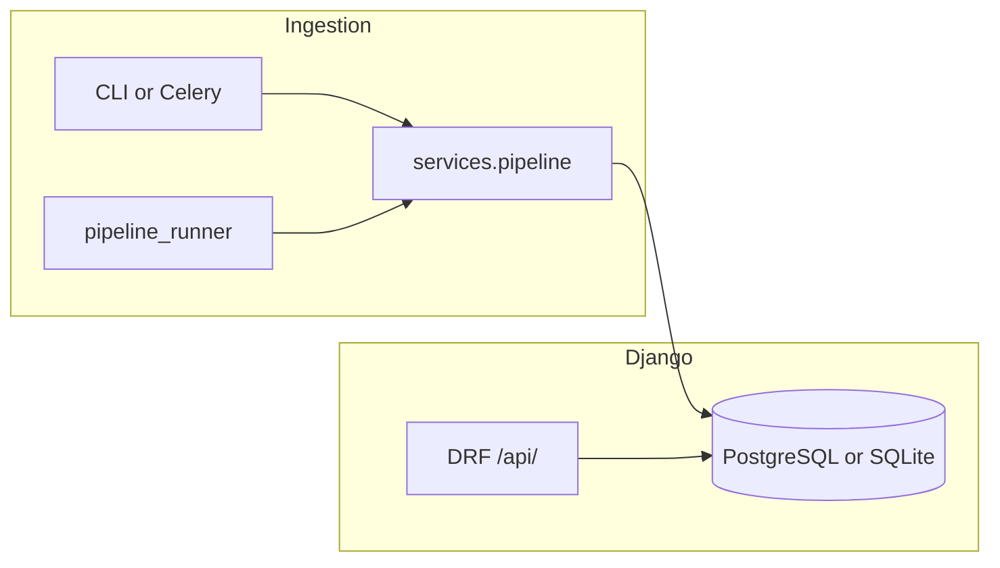
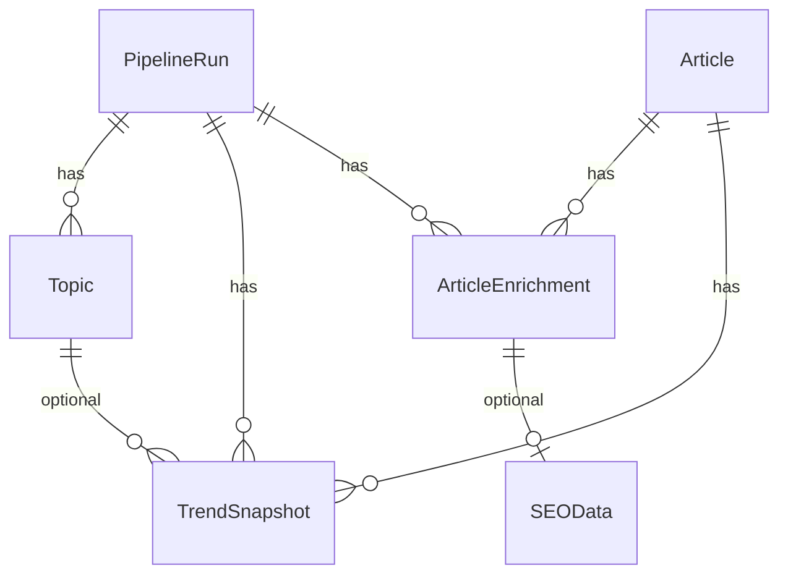

# Django project guide (for junior developers)

This document explains how the **Django + Django REST Framework (DRF)** part of the **Viral Trend Engine** fits together: folders, database models, how data gets in, and every HTTP API route with example responses.

---

## 1. Big picture

1. **`core`** + **`services`** — Python code that talks to Google Trends, RSS, scrapers, and OpenAI, then produces a list of enriched articles with scores. Optional CLI: `python -m core`.
2. **Persistence** — When `DJANGO_SETTINGS_MODULE` is set (and a database is configured), the pipeline saves rows into **Django’s database** via [`apps/processing/persistence.py`](../apps/processing/persistence.py) (invoked from [`core/db/persist.py`](../core/db/persist.py)).
3. **Django** — Hosts the **admin site**, **REST API** under `/api/`, optional **Celery** tasks, and the [`run_trend_pipeline`](../apps/processing/management/commands/run_trend_pipeline.py) management command (see [SHELL_PIPELINE.md](SHELL_PIPELINE.md) for shell examples).



---

## 2. Project directory (what matters)

Repository root is usually `d:\bhg` (or your clone path). **Ignore `venv/`** when reading code—that is third-party libraries.

| Path | Role |
|------|------|
| [`manage.py`](../manage.py) | Django’s command-line entry (`runserver`, `migrate`, `createsuperuser`, …). |
| [`config/`](../config/) | **Django project package** (not an “app”). Holds settings, root `urls.py`, WSGI/ASGI, Celery config. |
| [`config/settings/`](../config/settings/) | `base.py` loads env vars; `development.py` / `production.py` tweak `DEBUG`. |
| [`config/api/`](../config/api/) | **REST API**: `urls.py`, `views.py`, `serializers.py`, `pagination.py`. |
| [`apps/articles/`](../apps/articles/) | **App**: `Article`, `StoryCluster`, `ArticleEmbedding`, `UserFeedback`. |
| [`apps/processing/`](../apps/processing/) | **App**: `PipelineRun`, `ArticleEnrichment`, `pipeline_runner.py`, Celery `tasks.py`, Django `persistence.py`. |
| [`apps/trends/`](../apps/trends/) | **App**: `Topic`, `TrendSnapshot` (links a run + topic + article + score). |
| [`apps/seo/`](../apps/seo/) | **App**: `SEOData` (one-to-one with an enrichment). |
| [`services/`](../services/) | **Plain Python** pipeline orchestration (no Django imports). Called by CLI and Celery. |
| [`core/`](../core/) | Domain library: RSS, scrape, AI, scoring, `try_persist` (Django when configured). |
| [`tests/`](../tests/) | `pytest` tests; API smoke tests in `test_drf_api.py`. |
| [`pytest.ini`](../pytest.ini) | Sets `DJANGO_SETTINGS_MODULE` for tests. |

**Vocabulary**

- **Project** (`config`) — global settings and URL routing.
- **App** (`apps.*`) — reusable piece with its own `models.py` and `migrations/`.
- **Migration** — versioned change to the database schema; run `python manage.py migrate`.

---

## 3. How settings and environment work

[`config/settings/base.py`](../config/settings/base.py) uses **`django-environ`** to read [`.env`](../.env) from the project root.

| Variable | Purpose |
|----------|---------|
| `DJANGO_SETTINGS_MODULE` | Must be set to run Django (e.g. `config.settings.development`). |
| `DJANGO_SECRET_KEY` | Secret for sessions/signing; change in production. |
| `DEBUG` | `1` / `true` for local dev (more verbose errors). |
| `DATABASE_URL` | If set, Django uses PostgreSQL; if empty, **SQLite** file `db.sqlite3` in the project root. |
| `DJANGO_ALLOWED_HOSTS` | Comma-separated hostnames allowed to access the site. |
| `CELERY_BROKER_URL` / `CELERY_RESULT_BACKEND` | Redis URLs for background tasks. |
| `CELERY_TASK_ALWAYS_EAGER` | If `1`, Celery runs tasks in-process (no Redis needed for quick tests). |

Pipeline-related variables (`OPENAI_API_KEY`, `TREND_ENGINE_*`, etc.) are read by [`core/config.py`](../core/config.py), not only Django.

---

## 4. Database models (mental map)

Think of a **pipeline run** as one execution of the trend pipeline. It creates:

1. **`PipelineRun`** — one row per run (`geo`, `lang`, `status`, `meta` JSON).
2. **`Topic`** — trend labels for that run (from Google/Reddit signals).
3. **`Article`** — unique by `url`; stores title, domain, RSS source, **`category`** (RSS bucket, e.g. `technology`), etc.
4. **`ArticleEnrichment`** — LLM fields for an article tied to a run (summary, main_topic, …).
5. **`TrendSnapshot`** — one row per (run, article) score: `score_total`, `breakdown` JSON; optional link to **`Topic`**.
6. **`SEOData`** — optional SEO fields linked **one-to-one** to an `ArticleEnrichment`.



---

## 5. Running Django locally

From the project root, with venv activated:

```bash
set DJANGO_SETTINGS_MODULE=config.settings.development
python manage.py migrate
python manage.py runserver 0.0.0.0:8000
```

- **Admin**: create a superuser with `python manage.py createsuperuser`, then open `http://127.0.0.1:8000/admin/`.
- **API base URL**: `http://127.0.0.1:8000/api/`.

**Celery** (optional): with Redis running and `DJANGO_SETTINGS_MODULE` set:

```bash
celery -A config.celery worker -l info
```

`POST /api/runs/trigger/` schedules work on a worker; with `CELERY_TASK_ALWAYS_EAGER=1` it can run without a worker process.

**Run the pipeline from Django** (same code path as Celery): see [SHELL_PIPELINE.md](SHELL_PIPELINE.md) — `manage.py run_trend_pipeline` or `apps.processing.pipeline_runner.run_pipeline_and_persist` in the shell.

---

## 6. REST API reference

All JSON APIs below live under the **`/api/`** prefix (see [`config/urls.py`](../config/urls.py)).

**Pagination** (list endpoints): DRF **`PageNumberPagination`**.

- Default **20** items per page.
- Query params: **`page`** (1-based), **`page_size`** (optional, max **100**).

**Typical paginated response shape:**

```json
{
  "count": 42,
  "next": "http://127.0.0.1:8000/api/runs/?page=2",
  "previous": null,
  "results": [ ... ]
}
```

**Errors**

- **`503`** — `{"detail": "Database unavailable"}` if the database cannot be reached.
- **`400`** — Validation errors, e.g. invalid `run_id`: `{"run_id": ["Must be a valid integer."]}`.
- **`404`** — Unknown path or missing `Article` pk on detail route.

---

### 6.1 `GET /api/health/`

**Purpose:** Liveness check; does **not** require the database.

**Response `200`:**

```json
{
  "status": "ok"
}
```

---

### 6.2 `GET /api/runs/`

**Purpose:** List **pipeline runs** (newest first). This is what older docs sometimes called “trends” for runs.

**Query params:** `page`, `page_size` (pagination only).

**Response `200`:** paginated list of:

| Field | Type | Meaning |
|-------|------|---------|
| `id` | int | Run primary key. |
| `geo` | string | Region code used for trends (e.g. `IN`). |
| `lang` | string | Language code. |
| `started_at` | string (ISO 8601) | When the run started. |
| `finished_at` | string or null | When the run finished. |
| `status` | string | e.g. `completed`. |

**Example `results` item:**

```json
{
  "id": 3,
  "geo": "IN",
  "lang": "en",
  "started_at": "2026-04-07T12:00:00Z",
  "finished_at": "2026-04-07T12:05:00Z",
  "status": "completed"
}
```

---

### 6.3 `GET /api/trends/` and `GET /api/topics/`

**Purpose:** Same handler for both paths: list **`Topic`** rows for one pipeline run (trend keywords / sources).

**Query params:**

| Param | Required | Description |
|-------|----------|-------------|
| `run_id` | No | If omitted, uses the **latest** run. If there is no run, `results` is empty. |
| `category` | No | If set, only topics that have at least one **`TrendSnapshot`** whose **`Article.category`** matches (e.g. `technology`). |
| `page`, `page_size` | No | Pagination. |

**Response `200`:** paginated list of:

| Field | Type |
|-------|------|
| `id` | int |
| `label` | string |
| `source` | string (e.g. `google`, `reddit`) |
| `rank_in_source` | int or null |
| `reddit_score` | int or null |

**Example:**

```json
{
  "count": 15,
  "next": null,
  "previous": null,
  "results": [
    {
      "id": 101,
      "label": "example trend",
      "source": "google",
      "rank_in_source": 1,
      "reddit_score": null
    }
  ]
}
```

---

### 6.4 `GET /api/top-viral/` and `GET /api/articles/top/`

**Purpose:** Same handler: ranked **`TrendSnapshot`** rows (viral score) for a run.

**Query params:**

| Param | Description |
|-------|-------------|
| `run_id` | Optional; defaults to **latest** run. |
| `category` | Optional; filter `Article.category`. |
| `page`, `page_size` | Pagination. |

**Response `200`:** paginated list of:

| Field | Type | Notes |
|-------|------|--------|
| `article_id` | int | `Article` primary key. |
| `title` | string | |
| `url` | string | |
| `domain` | string | |
| `category` | string | RSS category stored on the article. |
| `score` | float | `score_total` from the snapshot. |
| `run_id` | int | Pipeline run id. |
| `summary` | string | From `ArticleEnrichment` for that run (if any). |
| `main_topic` | string | From enrichment. |
| `seo` | object or null | Flattened SEO fields if an `SEOData` row exists. |

**Example item:**

```json
{
  "article_id": 7,
  "title": "Example headline",
  "url": "https://news.example/article",
  "domain": "news.example",
  "category": "technology",
  "score": 8.4,
  "run_id": 3,
  "summary": "Short LLM summary…",
  "main_topic": "AI",
  "seo": {
    "optimized_title": "…",
    "meta_description": "…",
    "slug": "example-headline",
    "keywords": ["ai", "tech"]
  }
}
```

---

### 6.5 `GET /api/articles/<id>/`

**Purpose:** Single **`Article`** with optional enrichment + SEO for a run.

**Path:** `id` is the **`Article`** primary key.

**Query params:**

| Param | Description |
|-------|-------------|
| `run_id` | Optional. If omitted, enrichment/SEO use the **latest** pipeline run (if any). |

**Response `200`:**

| Field | Type |
|-------|------|
| `id` | int |
| `url` | string |
| `title` | string |
| `domain` | string |
| `category` | string |
| `source_rss` | string |
| `published_raw` | string or null |
| `created_at` | string (ISO 8601) |
| `updated_at` | string (ISO 8601) |
| `enrichment` | object or null |
| `seo` | object or null |

**`enrichment` object** (when present):

```json
{
  "summary": "…",
  "main_topic": "…",
  "why_trending": "…",
  "why_people_care": "…",
  "who_should_care": "…",
  "content_angle_ideas": ["idea 1", "idea 2"]
}
```

**`seo` object** — same shape as in top-viral (from `SEOData`), or `null`.

---

### 6.6 `POST /api/runs/trigger/`

**Purpose:** Enqueue a **full pipeline run** via **Celery** (async). Returns immediately with a task id.

**Content-Type:** `application/json` (body optional) or use query string; both are read.

**Common body / query fields:**

| Field | Type | Description |
|-------|------|-------------|
| `limit` | int | Max clustered stories (default `10`). |
| `with_reddit` | bool | Include Reddit signals. |
| `skip_ai` | bool | No OpenAI calls; placeholders + token match. |
| `skip_seo` | bool | Force SEO pass off. |
| `include_unmatched` | bool | Backfill RSS by category. |
| `seo_cli_on` | bool | Force SEO on for this run (still needs API key + gates). |
| `seo_cli_off` | bool | Force SEO off. |

**Response `202`:**

```json
{
  "status": "scheduled",
  "task_id": "a1b2c3d4-e5f6-7890-abcd-ef1234567890"
}
```

---

### 6.7 `POST /api/feedback/`

**Purpose:** Store a **`UserFeedback`** row (human labels on articles or clusters).

**Body (JSON):**

| Field | Type | Required |
|-------|------|----------|
| `label` | string (max 64) | Yes |
| `notes` | string | No |
| `article_id` | int or null | No |
| `story_cluster_id` | int or null | No |

**Response `201`:**

```json
{
  "id": 5
}
```

---

## 7. Where to edit things (cheat sheet)

| Task | Where to look |
|------|----------------|
| Add or change an API route | [`config/api/urls.py`](../config/api/urls.py) |
| Change response fields | [`config/api/serializers.py`](../config/api/serializers.py) |
| Change filtering / permissions | [`config/api/views.py`](../config/api/views.py) |
| Change page size defaults | [`config/api/pagination.py`](../config/api/pagination.py) |
| Add a DB column | App’s `models.py` → `makemigrations` → `migrate` |
| Change what gets saved from the pipeline | [`apps/processing/persistence.py`](../apps/processing/persistence.py) |
| Change pipeline steps / ordering | [`services/pipeline.py`](../services/pipeline.py) |

---

## 8. Related docs

- [DATA_MIGRATION.md](../DATA_MIGRATION.md) — moving from SQLAlchemy/Alembic to Django tables.
- [README.md](../README.md) — full product features and CLI.
- [SHELL_PIPELINE.md](SHELL_PIPELINE.md) — Django shell / `run_trend_pipeline` for the pipeline.
- [DJANGO_INTEGRATION.md](DJANGO_INTEGRATION.md) — layers: `core` / `services` / Django apps.
- [TESTING.md](../TESTING.md) — manual testing ideas for the trend pipeline.

---

## 9. Quick sanity checklist

1. `DJANGO_SETTINGS_MODULE=config.settings.development`
2. `python manage.py migrate`
3. `python manage.py runserver`
4. Open `GET http://127.0.0.1:8000/api/health/`
5. Run the pipeline (CLI with Django env, or `POST /api/runs/trigger/`) so **`/api/runs/`** and **`/api/trends/`** have data
6. Query **`/api/top-viral/?run_id=<id>`**

If lists are empty, there is simply no data in the database yet—not necessarily a bug.
